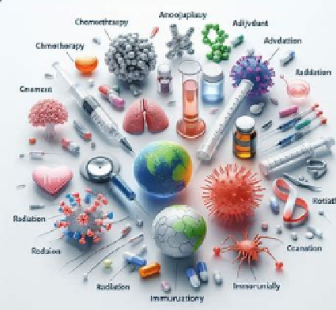

# Cancer Treatment Modalities - Analysis of major treatment modalities and the cancers (tumors type) they treat
Analysis of major treatment modalities and the cancers (tumors type) they treat

Welcome to the solution **Cancer Treatment Modalities** - an example for your projects

Analysis of major treatment modalities and the cancers (tumors type) they treat
## instructions 
# Cancer Treatment Modalities - Analysis of major treatment modalities and the cancers (tumor types) they treat

## Description

Welcome to the solution **Cancer Treatment Modalities**   

## Analysis of major treatment modalities and the cancers (tumors type) they treat

## Modalities in cancer treatment
- **Surgery** - Surgical removal of cancerous tumors or tissues.
- **Chemotherapy** - Treatment using drugs to kill cancer cells or slow their growth.
- **Radiation Therapy** - Treatment using high-energy rays or particles to destroy cancer cells.
- **Immunotherapy** - Treatment that uses the body's immune system to fight cancer.
- **Adjuvant Chemotherapy** - Chemotherapy given after surgery to kill any remaining cancer cells.
- **Targeted Therapy** - Treatment that targets specific genes, proteins, or pathways involved in cancer growth.
- **Hormone Therapy** - Treatment that blocks the effects of hormones or stops the body from making them.

## Analysis approach for multi-model cancer treatment
- Identify Major Treatment Modalities - Identify and categorize the major treatment modalities used in cancer treatment.
- Understand Cancer Types and Tumor Characteristics - Gain a comprehensive understanding of the different types of cancer and the characteristics of tumors they represent.
-  Match Treatment Modalities to Cancer Types - Analyze which treatment modalities are most effective for specific cancer types and tumor  characteristics.
-  Evaluate Efficacy and Side Effects - Assess the efficacy and potential side effects of each treatment modality in the context of specific cancer types.
-  Develop Treatment Plans and Multidisciplinary Approaches - Develop comprehensive treatment plans tailored to individual patients and consider the use of multidisciplinary approaches.

    
## Features
- Easy to understand and use  
- Easily Configurable 
- Quickly start your project with pre-built templates
- Its Fast and Automated
    
## Notebook Features
- Self Documenting 
- Self Testing 
- Easily Configurable
- Includes Talking Code - The code explains itself
- Self Logging 
- Self Debugging 
- Low Code - or - No Code
- Educational 
    

     

## Features
- Easy to understand and use  
- Easily Configurable 
- Quickly start your project with pre-built templates
- Its Fast and Automated

## Notebook Features
- **Self Documenting** - Automatically identifes major steps in notebook 
- **Self Testing** - Unit Testing for each ptyhon function
- **Easily Configurable** -easily modifyable with config.INI name value pairs
- **Includes Talking Code** - The code explains itself.
- **Self Logging** - enhanced python standard logging   
- **Self Debugging** - enhanced python standard debugging
- **Low Code - or - No Code** - Most solutions are under 50 lines of code
- **Educational** - Includes educational dialogue and background material
    
## Getting Started
To get started with the **Cancer Treatment Modalities** solution repository, follow these steps:
1. Clone the repository to your local machine.
2. Install the required dependencies listed at the top of the notebook.
3. Explore the example code provided in the repository and experiment.
4. Run the notebook and make it your own - **EASY !**
    
## https://github.com/JoeEberle/ -- josepheberle@outlook.com 
    

       