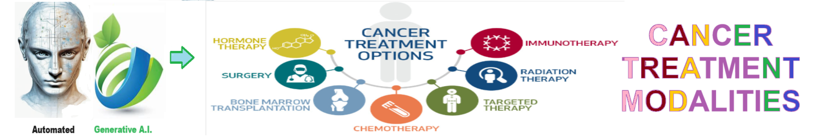
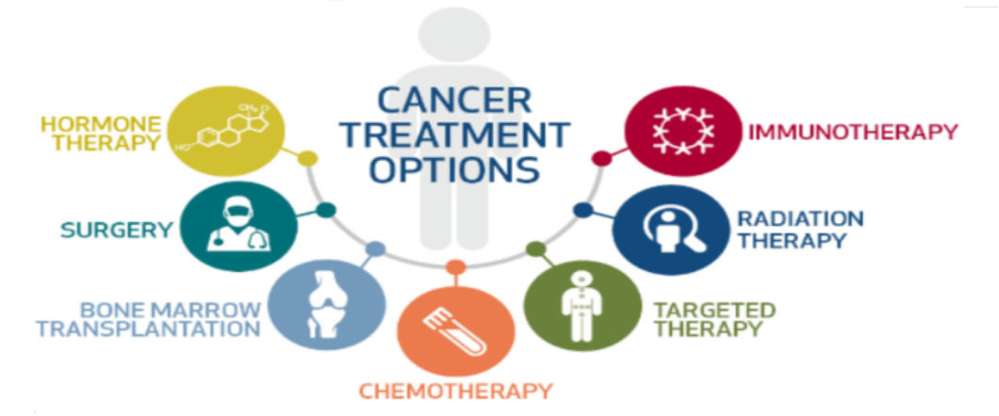
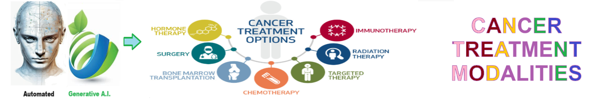
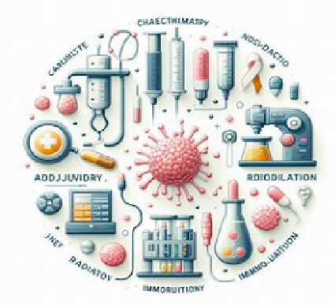
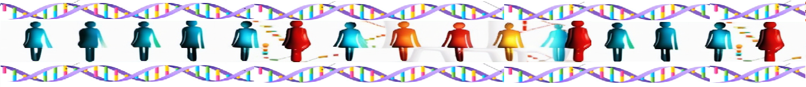

# Cancer Treatment Modalities - Analysis of major treatment modalities and the cancers (tumors type) they treat
Analysis of major treatment modalities and the cancers (tumors type) they treat

Common **treatment protocols** for cancer patients typically involve a **multidisciplinary approach** tailored to the type and stage of cancer. These protocols commonly include surgery, chemotherapy, radiation therapy, immunotherapy, targeted therapy, and hormone therapy.  Combinations of these modalities are often employed to maximize effectiveness. For example, patients may undergo surgery followed by chemotherapy and radiation to eradicate remaining cancer cells and reduce the risk of recurrence. Additionally, immunotherapy and targeted therapy may be used in conjunction with traditional treatments to enhance their efficacy, particularly in advanced or metastatic cancers. The goal of combining these modalities is to achieve better outcomes by targeting cancer cells through multiple mechanisms while minimizing side effects.

**Neo-adjuvant** protocols are changing cancer care by allowing for treatment before primary therapy, potentially reducing tumor size and increasing the success of subsequent interventions. **Adjuvant therapy** complements primary treatments by targeting any remaining cancer cells, reducing the risk of recurrence, and improving long-term outcomes. Together, these protocols enhance the effectiveness of cancer treatment strategies and contribute to improved patient survival and quality of life.

 ## Analysis approach for multi-modal cancer treatment 
 1. **Identify Major Treatment Modalities** - Identify and categorize the major treatment modalities used in cancer treatment. 
  2. **Understand Cancer Types and Tumor Characteristics** - Gain a comprehensive understanding of the different types of cancer and the characteristics of tumors they represent. 
  3. **Match Treatment Modalities to Cancer Types** - Analyze which treatment modalities are most effective for specific cancer types and tumor characteristics. 
  4. **Evaluate Efficacy and Side Effects** - Assess the efficacy and potential side effects of each treatment modality in the context of specific cancer types. 
  5. **Develop Treatment Plans and Multidisciplinary Approaches** - Develop comprehensive treatment plans tailored to individual patients and consider the use of multidisciplinary approaches. 
  

 ## Cancer Treatment Modalities 
 1. **Surgery** - Surgical removal of cancerous tumors or tissues. 
  2. **Chemotherapy** - Treatment using drugs to kill cancer cells or slow their growth. 
  3. **NeoAdjuvant Chemotherapy** - Neoadjuvant systemic therapy is treatment given before surgery to shrink a large tumor and/or reduce the risk of recurrence. Chemotherapy, immunotherapy, hormonal therapy, and/or targeted therapy may all be given as neoadjuvant treatments for people with certain types cancer. 
  4. **Radiation Therapy** - Treatment using high-energy rays or particles to destroy cancer cells. 
  5. **Immunotherapy** - Treatment that uses the body's immune system to fight cancer. 
  6. **Adjuvant Chemotherapy** - Chemotherapy given after surgery to kill any remaining cancer cells. 
  7. **Targeted Therapy** - Targeted therapy is a treatment that targets the cancer’s specific genes, proteins, or the tissue environment that contributes to cancer growth and survival.  
  8. **Hormone Therapy** - Treatment that blocks the effects of hormones or stops the body from making them. 
  

## Getting Started
To get started with the **Cancer Treatment Modalities** solution repository, follow these steps:
1. Clone the repository to your local machine.
2. Install the required dependencies listed at the top of the notebook.
3. Explore the example code provided in the repository and experiment.
4. Run the notebook and make it your own - **EASY !**
    
## Solution Features
- Easy to understand and use  
- Easily Configurable 
- Quickly start your project with pre-built templates
- Its Fast and Automated

## Notebook Features
- **Self Documenting** - Automatically identifes major steps in notebook 
- **Self Testing** - Unit Testing for each function
- **Easily Configurable** - Easily modify with **config.INI** - keyname value pairs
- **Includes Talking Code** - The code explains itself 
- **Self Logging** - Enhanced python standard logging   
- **Self Debugging** - Enhanced python standard debugging
- **Low Code** - or - No Code  - Most solutions are under 50 lines of code
- **Educational** - Includes educational dialogue and background material
- **Secure** - All the sample solutions are secure and use synthetic data, ensuring they contain no sensitive data or information.
    
## Deliverables or Figures
       
    

## Github    
## https://github.com/JoeEberle/ 

## Email 
## josepheberle@outlook.com 

    

    